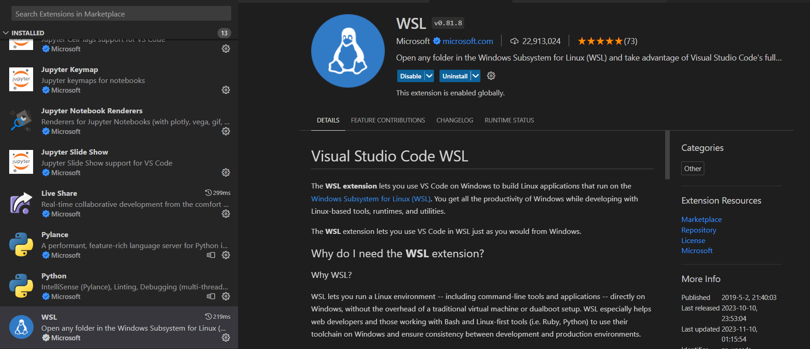
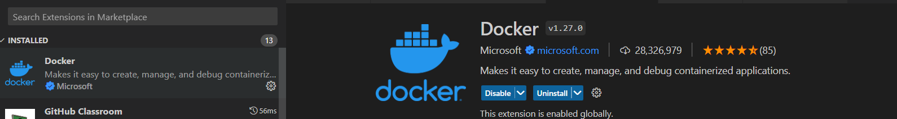
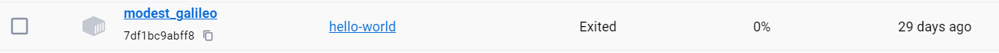
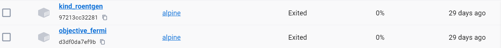
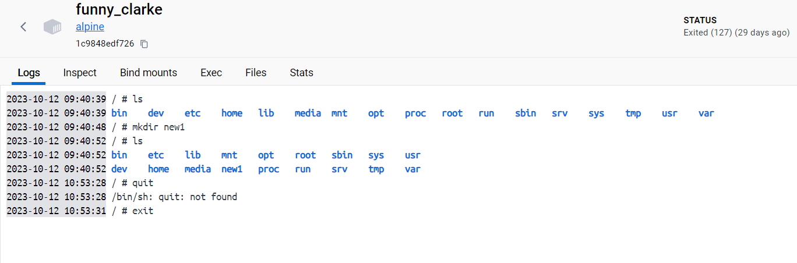
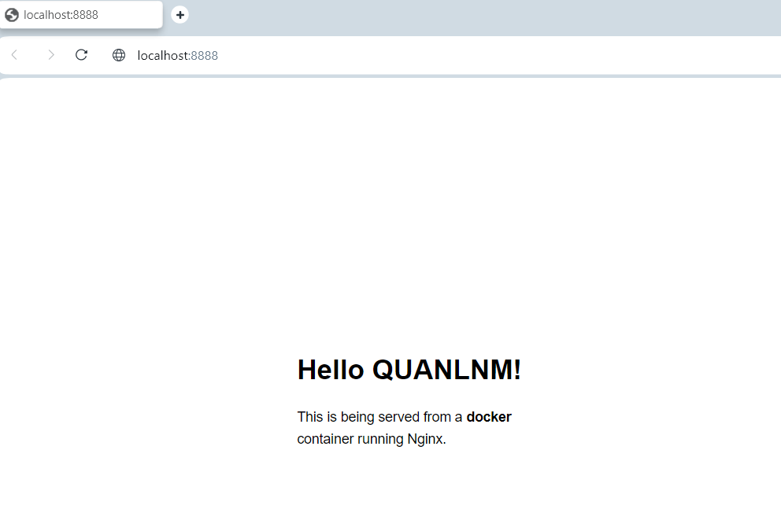
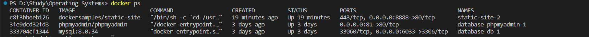
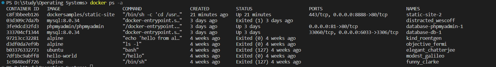
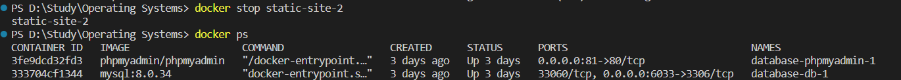
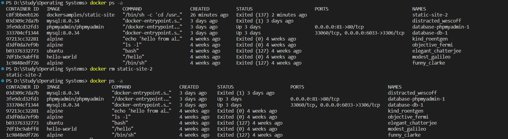

## Docker Basics Tasks
1. Open Visual Studio Code & install the WSL extensions and Docker extension in the Visual Studio Code.

2. Do the following tasks using Visual Studio Code:

    i. Use Docker run command to run a docker container based on hello-world image
    

    ii. Use Docker run command to run a docker container based on alpine image
    

    iii.Use Docker run command to run a docker container based on alpine image and get access to the container shell.

        a.Use mkdir command to make some directories.

        b.Use exit command to exit from the container’s shell.
    
    

    iv. Run a static website in a container using an existing image “static-site”.
        a. docker run --name static-site-2 -e AUTHOR="Your Name" -d -p 8888:80 dockersamples/static-site
        

        b.Type localhost:8888 in your browser.
    

    v. List all containers that are currently running in your system
    

    vi. List all containers both running & the ones that are stopped
    

    vii. Stop one of your running containers.
    

     9 Remove one of your containers.
    